# 1_single_dipole.gif
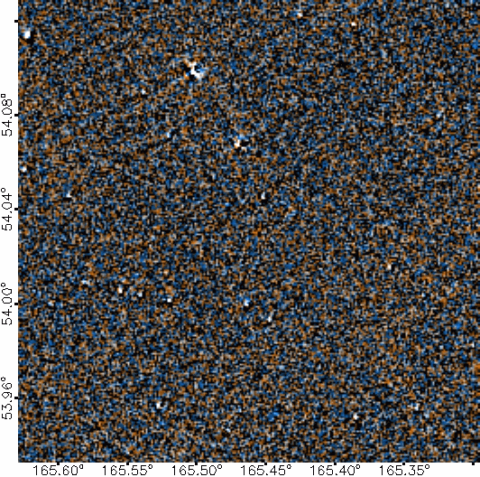
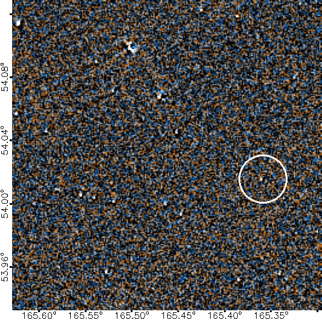
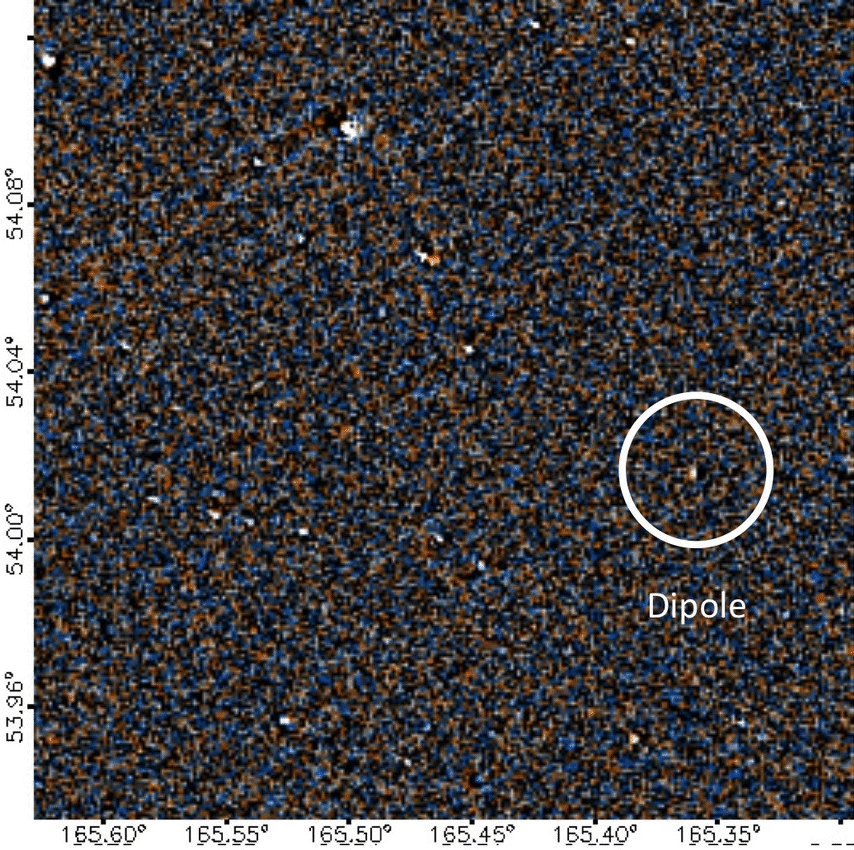

When a brown dwarf or star moves relatively slowly through the images, it appears as a positive image next to a negative image--a "dipole". A dipole may look like a half-moon and it may be any color. The bright spot moves from one side to the other, generally flipping sides after the first frame in the flipbook. Dipoles are rarer than ghosts and other artifacts, but more common than movers.

This example dipole is the first brown dwarf discovered by Backyard Worlds: Planet 9. You can see the discovery images here on its pre-reboot talk page and read our paper about it in the Astrophysical Journal Letters.

Notice that there are brighter objects in the flipbook. But the brighter the object, the more likely it is that someone else has already discovered it!

# 2_single_bright_dipole.gif
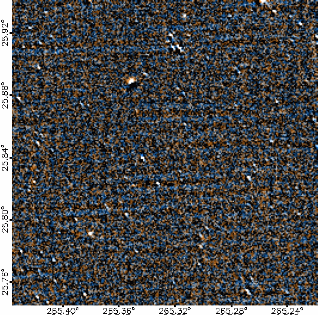
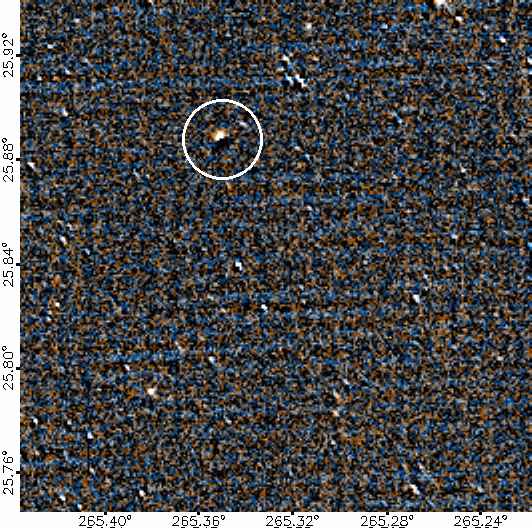
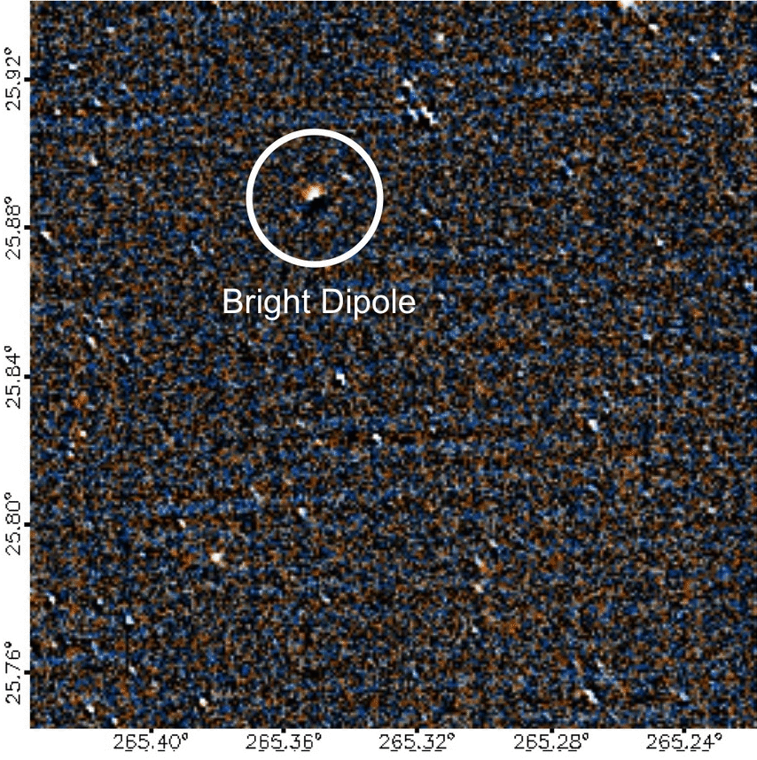

This relatively bright dipole (WISE 2 magnitude 12.3) with high proper motion (1560 milliarcseconds per year) is a known brown dwarf, spectral type T9.

You can find out more about it on its TALK page. (Suggested by Andres Stenner.)

By the way, sometimes the flipbook will appear to be full of dipoles; every bright point may resemble a dipole! That's because of slight errors in the direction the telescope was pointed when it took one of the images. When you hit play these false dipoles often reveal themselves. But when this happens, often the best you can do is simply to search for objects that dance around differently than the other sources.

# 3_single_brighter_dipole.gif
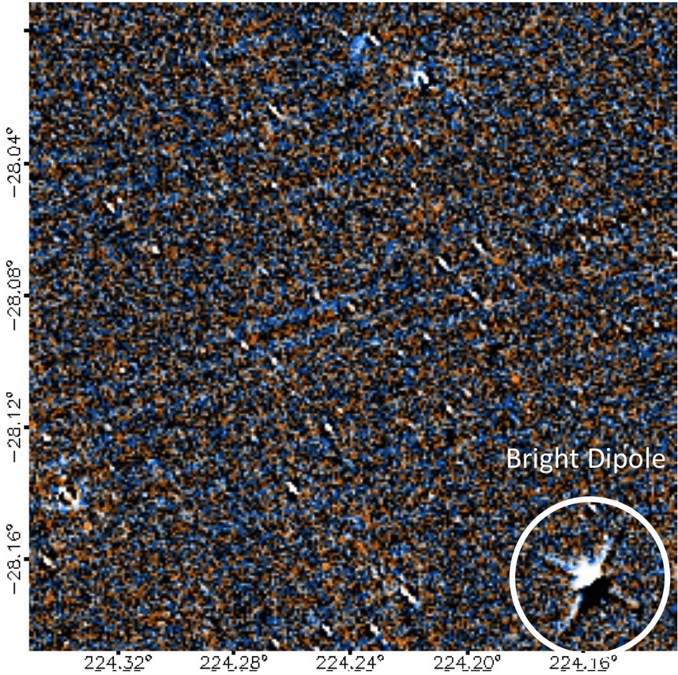
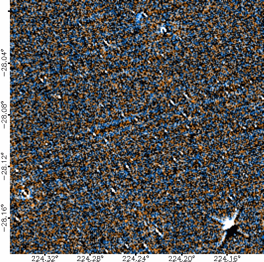
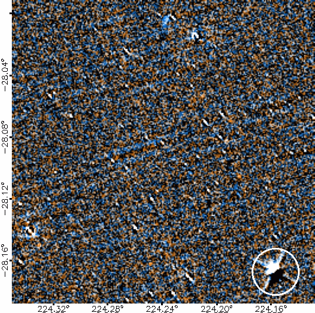
Here's an even brighter dipole with four diffraction spikes, an M7 flare star with proper motion of 976 milliarcsec/yr. You can learn more on its TALK page.

# 4_planet9.gif
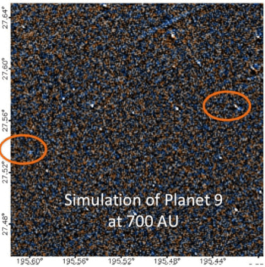

If planet nine does exist, it should look like a very fast mover. Unlike brown dwarfs, which can zip in any direction, the planet's motion is most likely to be more or less horizontal in our flipbooks.

Also unlike brown dwarfs, there may also be a second copy of Planet 9 in the data! The second copy is created by orbital motion of the Earth between WISE scans. The two copies could be up to 12 arcminutes apart, and may or may not show up in the same flipbook, as the example below illustrates.

The speed planet nine moves will depend on its distance to the Sun. The example above assumes that planet nine is 700 times as far from the Sun as the Earth is. Note that prior to our reboot (November 2018) planet 9 made a complex combination of jumps and hops in the flipbooks, as described in this blog post. Now things are much simpler! You can now assume that planet nine is now just a regular mover.

Nobody knows exactly what color planet nine will be, but models suggest that it will likely appear blue in our WISE images if it is less than about 15 times the mass of the Earth. If it is more than about 15 times the mass of the Earth, however, it is more likely to be red in our flipbooks. In any case, Planet Nine will be faint--right at the limits of what we can see.

# 5_faint_mover.gif
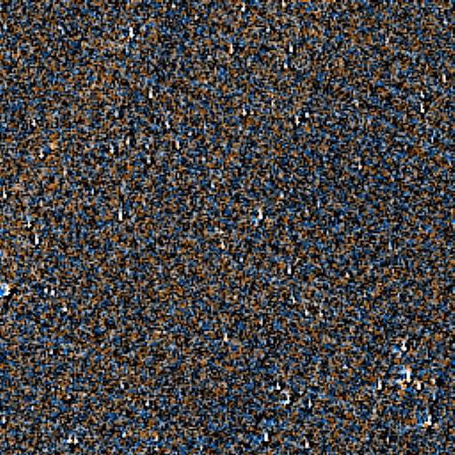
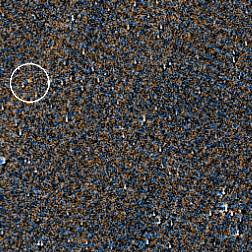
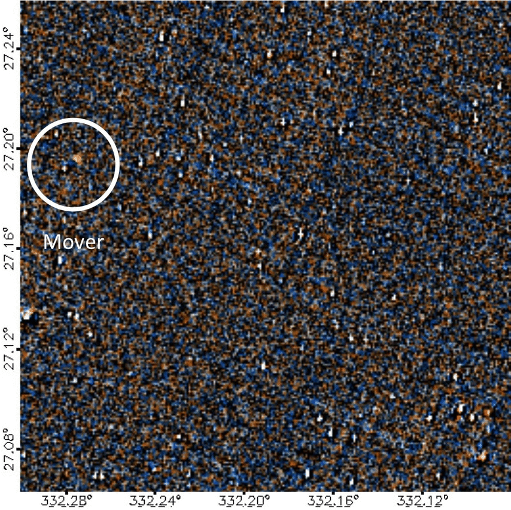
Some movers can be very faint, or partly obscured by an artifact. Planet 9, if it exists, could be a very faint mover. This example is a brown dwarf, named
WISE J220905.73+271143.9.

This Y0 dwarf has a a WISE 2 magnitude of 14.8 and a proper motion of about 1373 milliarcseconds per year. You can learn more about it on its TALK page.

# 6_bright_mover.gif

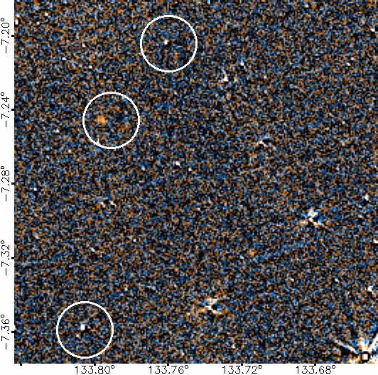

A mover is a small dot that moves in more or less a straight line. It can be any color, but it should be more or less round. It's often accompanied by a black "negative" image that leads it or trails behind. A true mover keeps going in the same direction the whole time and does not swerve or go in circles. It may be accompanied by a second moving dot.

Ghosts often resemble movers. But while a ghost may disappear in two or more frames, a true mover will appear in at least three of the frames. **Movers tend to move the most between the first and second frames since there is generally a bigger interval in time between those frames.**

This example is WISE 0855, the coldest known brown dwarf, with a W2 magnitude of 13.7. Here is its pre-reboot TALK page.

# 6_2_dipoles.gif
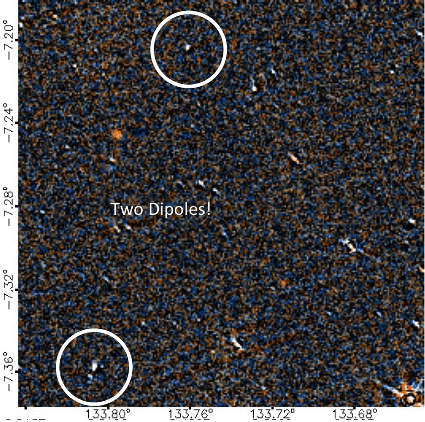

Here's a flipbook containing two relatively faint dipoles, marked by the white circles. And you can't miss that bright red mover in the middle. That's right, there are three objects of interest on this one flipbook!

By the way, that red mover is the one from the tutorial: the "bright mover" example. It is a Y dwarf called WISE 0855-0714.

# 6_artifacts
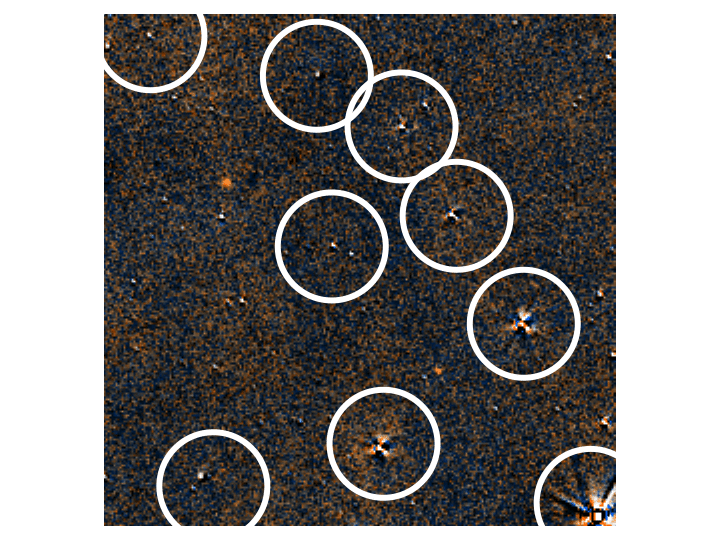

Many stars vary somewhat in brightness and color. The result is an artifact that often has four points, and may shift around or vary in shape and color. They can be tiny dots or huge explosions of light and color, taking up the whole image. Nearly every image will have many of these stellar artifacts.

# 7_ghost.gif
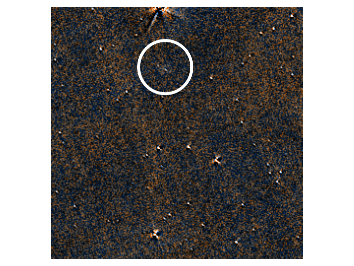

Ghost images are artifacts caused by light from a nearby bright star bouncing around inside the camera; they are often located near a bright star. These blurry blobs of light tend to jump around or appear and disappear. For more information on ghost images and other kinds of image artifacts on the WISE data, take a peek at this webpage.

# 8_ghost_and_potential_mover.gif
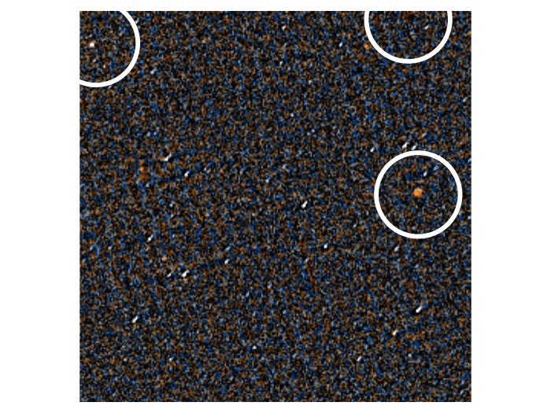

This flipbook has multiple ghost images that resemble movers. Note the blue one on the top right and the orange one in the middle right. Unfortunately, this kind of ghost is much more common than a real mover. You can tell these ghosts are not movers because they only appear in one image each. A real mover appears in at least three images.

There is also a white object on the left that appears in the first two images. This could conceivably be a mover that has moved off the left edge of the image in the third and fourth frames.
